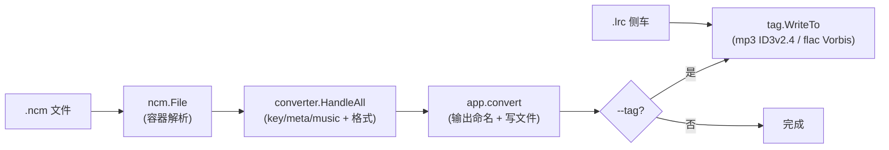

# NCMconverter 系统架构

> 最后更新：2026-09-27（v0.1.0）。本文档是系统总览；每个子系统的细节见 [`../features/`](../features/) 对应目录，历史决策见 [`architecture.md`](architecture.md)（ADR）。

## 1. 定位与设计原则

NCMconverter 是一个 Go 命令行工具，把网易云音乐的 `.ncm` 容器转换成可播放的 mp3 或 flac，并保留元数据、封面与歌词。

- **单向管线**：容器解析 → 解密解码 → 写文件 → 写标签，没有反向依赖（[ADR-002](architecture.md#adr-002-单向管线internal-全私有)）。
- **关注点分离**：字节布局（`ncm`）、密码学（`converter`）、格式标签（`tag`）、编排（`app`）各司其职。
- **可测试优先**：测试夹具独立于被测代码（[ADR-003](architecture.md#adr-003-测试用独立的合成容器构造器internalncmtest)）。
- **批处理友好**：并发转换、单文件失败隔离、非零退出码（[ADR-007](architecture.md#adr-007-errgroup-并发--单文件失败隔离--最终非零退出)）。

## 2. 模块概览

| 路径                  | 职责                                                                   | 详细文档                                                     |
| --------------------- | ---------------------------------------------------------------------- | ------------------------------------------------------------ |
| `cmd/ncmconverter`    | 命令行入口：解析参数、组装 `app.Options`、设置日志与版本打印           | [`../features/cli/`](../features/cli/cli-and-orchestration.md) |
| `internal/app`        | 编排：收集待转换文件、按并发度调度、定位歌词侧车、输出命名、写文件     | [`../features/cli/`](../features/cli/cli-and-orchestration.md) |
| `internal/ncm`        | 容器解析：按各段长度前缀切出 key/meta/cover/music                      | [`../features/container/`](../features/container/container-format.md) |
| `internal/converter`  | 解密 key 与 meta、解除音频混淆、解码元数据、判定音频格式               | [`../features/converter/`](../features/converter/decryption.md) · [`../features/metadata/`](../features/metadata/metadata.md) |
| `internal/tag`        | 标签写入门面：接口 `Tagger`、封面策略、按格式分派                      | [`../features/tagging/tag.md`](../features/tagging/tag.md)   |
| `internal/tag/mp3`    | mp3 的 ID3v2.4 标签写入                                                | [`../features/tagging/mp3-id3.md`](../features/tagging/mp3-id3.md) |
| `internal/tag/flac`   | flac 的 Vorbis comment、picture 与歌词写入                             | [`../features/tagging/flac-vorbis.md`](../features/tagging/flac-vorbis.md) |
| `internal/ncmtest`    | 测试用的合成容器构造器（独立实现格式）                                 | [`../engineering/testing.md`](../engineering/testing.md)     |

数据流是单向的：

## 3. 容器格式

一个 `.ncm` 文件是若干带长度前缀的段落拼接。除最前面的魔数外，每段前都有一个 little-endian 的 `uint32` 记录其后字节数：

| 偏移                | 大小       | 内容                                      |
| ------------------- | ---------- | ----------------------------------------- |
| 0                   | 8          | 魔数，ASCII 的 `CTENFDAM`                 |
| 8                   | 2          | 填充                                      |
| 10                  | 4          | key 段长度                                |
| 14                  | `keyLen`   | key 段                                    |
| `14+keyLen`         | 4          | meta 段长度                               |
| `18+keyLen`         | `metaLen`  | meta 段                                   |
| `metaEnd`           | 4          | 校验字段，**不是 CRC32**（不校验）        |
| `metaEnd+4`         | 1          | meta 段版本，实测恒为 `0x01`（不校验）    |
| `metaEnd+5`         | 4          | reserved，实测与 cover 长度相同（不读取） |
| `metaEnd+9`         | 4          | cover 段长度                              |
| `metaEnd+13`        | `coverLen` | cover 段，一张 JPEG 或 PNG                |
| `metaEnd+13+coverLen` | 剩余     | 混淆后的音频帧                            |

布局是对真实容器实测得到的。`metaEnd+5` 处的 reserved 字段目前不读取，但紧随其后的 cover 长度必须被计入，否则音频偏移会错位。`metaEnd` 的 4 字节常被文档称为 CRC32，实测与任何算法都对不上，**故意不校验**（来龙去脉见 [`../features/container/container-format.md`](../features/container/container-format.md) §4）。**容器本身不保存歌词**，歌词只可能来自与容器同名的 `.lrc` 侧车文件。

## 4. 解密流程

1. **key 段**：逐字节异或 `0x64`，再做 AES-128-ECB 解密，明文以 `neteasecloudmusic` 开头。去掉该前缀后的字节就是派生音频密钥盒的种子。
2. **meta 段**：逐字节异或 `0x63`，明文以 `163 key(Don't modify):` 开头；去掉前缀后 base64 解码，再 AES-128-ECB 解密，得到以 `music:` 开头的 JSON。同一段 JSON 既含曲目字段也含专辑字段，因此解析两次分别装入 `Meta` 与 `Album`。
3. **music 段**：用 key 派生出 256 字节的密钥盒，按 `0x8000` 字节一块解除混淆；**密钥盒的位置在每块开头重置**，块边界算错就会破坏音频（[postmortem 001](../postmortem/001-audio-tail-corruption.md)）。
4. **格式判定**：优先采用 meta 声明的 `format`；缺失时再由音频开头魔数判定（`fLaC` 为 flac，`ID3` 或 MPEG 同步字为 mp3）。两者冲突时以 meta 为准。

标识符字段（`musicId`、`albumId`、artist id）可能被编码成 JSON 数字，也可能被编码成字符串，`converter.Int64` 同时接受这两种形态且不丢精度。

## 5. 标签写入策略

`tag.Tagger` 是各格式共有的一组 `Set*` 方法：每个方法只记录值，`Save` 一次性落盘并释放文件，`Close` 在不写入的前提下释放文件且可重复调用，便于与 `defer` 搭配。

两条共同的语义：

- **已有值优先**：每个 `Set*` 都只在目标字段**尚未存在**时写入，因此源音频里已带的标签不会被覆盖。
- **装饰性数据不致命**：封面无法嵌入只记一条警告，不阻断其余元数据。

分格式的差异：

- mp3 固定写到 **ID3v2.4 + UTF-8**。源音频常常带着 ID3v2.3，而该版本默认的 ISO-8859-1 编码无法表示任何非拉丁文标题或艺人，所以版本必须被顶掉。歌词写入 `USLT` 帧。
- flac 使用 **Vorbis comment**；`LYRICS` 没有库常量，使用自定义 key。封面是独立的 picture 元数据块。
- flac 规范只允许一个 comment 块，`internal/tag/flac` 会复用已存在的块并在原位置重写，避免反复保存时不断追加。

## 6. 歌词

歌词来自源文件旁边同名的 `.lrc`。缺失是正常情况，不构成错误。读取时会丢掉 UTF-8 BOM；当内容不是合法 UTF-8 时，按 GBK 解码（网易云早期把歌词存成 GBK）。内容原样嵌入——`.lrc` 开头的几行 JSON 曲目信息不做归一化，以免丢失信息。

## 7. 测试策略

- **合成容器**：`internal/ncmtest` 独立地重新实现容器格式，而不是复用被测代码。这样读取端的 bug 不会同时藏进本该抓住它的夹具里。
- **端到端**：`internal/app` 的测试会真实转换合成容器，并逐字节校验产物中的音频与容器内容一致（含标签），只有真正可读的产物才算通过。
- **真实 fixture**：`testdata/` 下的 `.ncm` 会启用一组针对真实文件的端到端断言。这些夹具是回归的锚点，不应为了跑通测试而修改；目录存在但无容器时测试**失败**而非跳过（[postmortem 011](../postmortem/011-fixture-empty-run.md)）。

完整的分层、边界清单与「行为 → 测试」映射见 [`../engineering/testing.md`](../engineering/testing.md)。

## 8. 构建与发布

本地用 `Makefile` 把版本信息经 `-ldflags` 注入二进制；发布由 `v*` tag 触发 GoReleaser，交叉编译三平台并生成 deb/rpm 与校验和。详见 [`../features/release/release-artifacts.md`](../features/release/release-artifacts.md)。
